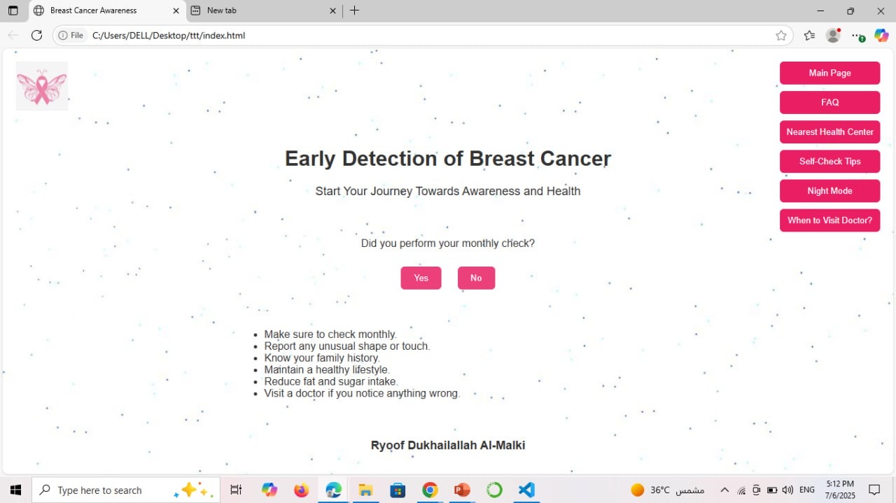
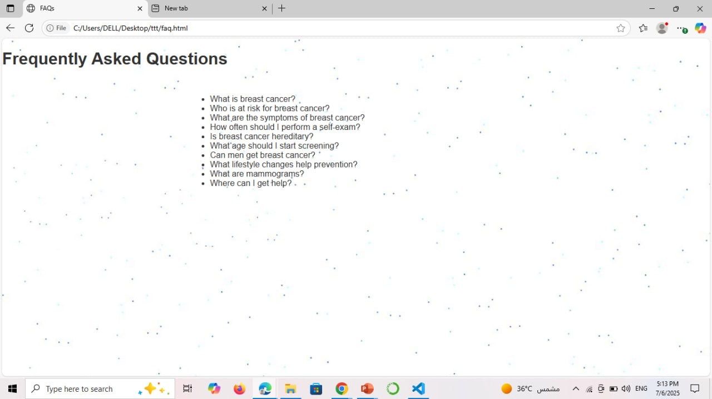
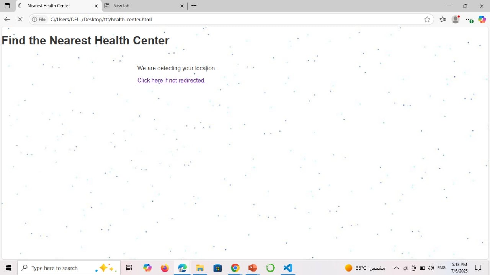
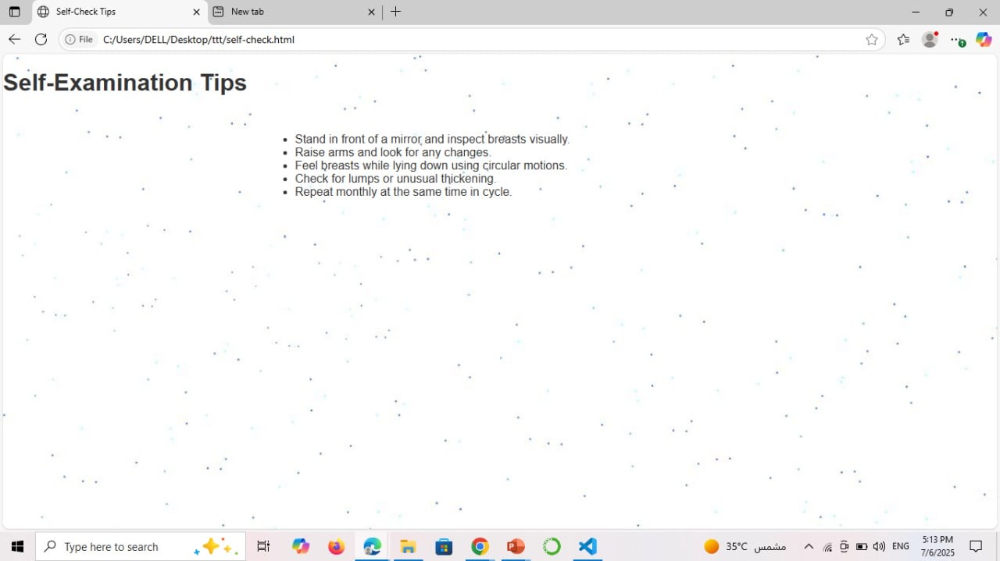
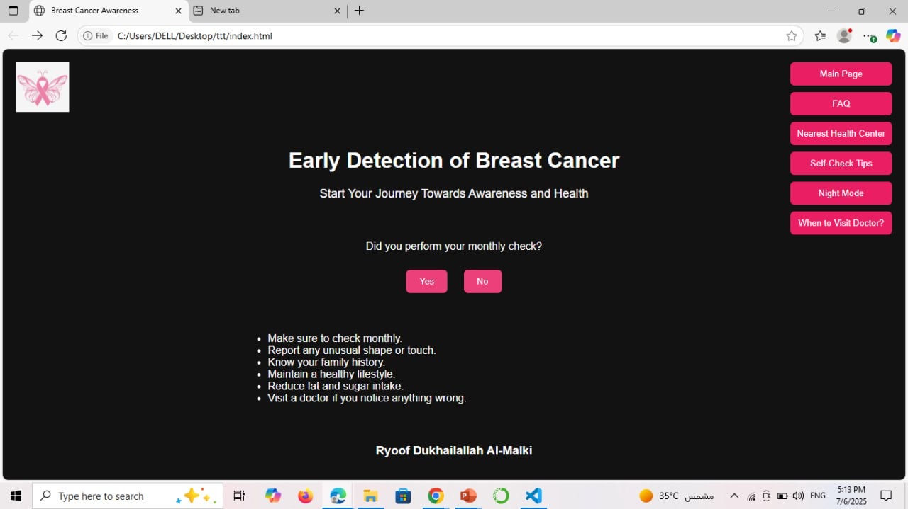
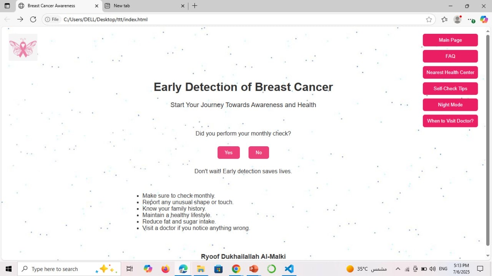

# 🌐 Early Detection of Breast Cancer Awareness Website

## 📌 Project Overview
This web project aims to raise awareness about early detection of breast cancer through a simple, interactive interface.
Users can access important health information, self-check tips, FAQs, and be redirected to nearby health centers.
The website is designed to encourage early self-checks and medical consultations in a friendly, motivating layout.

---

## 💻 Technologies Used
- HTML – Page structure
- CSS – Visual design and layout
- JavaScript – Dynamic interactions and page behavior

---

## 📁 Files Included

| File Name             | Description                            |
|----------------------|----------------------------------------|
| index.html          | Main landing page                     |
| faq.html            | Frequently Asked Questions            |
| health-center.html  | Redirects to nearest health center via Google Maps |
| self-check.html     | Self-examination tips                 |
| doctor-visit.html   | When to visit a doctor                |
| style.css           | Styling and layout                    |
| script.js           | JavaScript for interactivity and night mode |
| PINK.jpg            | Breast cancer awareness ribbon/logo   |
| stars.jpg           | Calming starry background             |
| IMG_5821.jpeg – IMG_5829.jpeg | Screenshots of each section of the website |
| README.md           | Project documentation file            |

---

## 🖼️ Screenshots of the Website

---

### 🏠 Home Page – Main landing page with navigation and awareness prompt

---

### ❓ FAQ Page – 10 most common questions answered clearly

---

### 🩺 Self-Check Page – Monthly self-exam guidance with helpful tips

---

### 📅 Doctor Visit Page – Signs that require visiting a specialist

---

### 📍 Health Center Page – Redirects to Google Maps for nearest center

---

### 🌙 Night Mode – Example with dark mode enabled

---

### 🧾 Project Folder – Organized files in Visual Studio Code

---

### 💻 index.html & script.js – Core HTML and JS interaction logic

---

### 🎨 style.css – Styling and responsive layout in CSS

---

## 🌸 Final Note

Dedicated to every soul holding on with strength and grace.  
May awareness bring light, and may early detection save lives.

---
## 🪄 Created By  
🎀 Ryoof Dukhailallah Al-Malki 🎀
